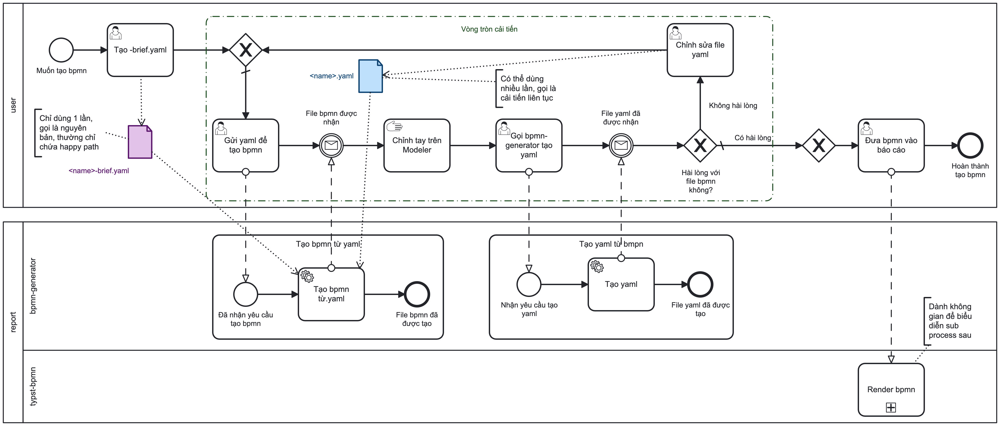

# Quy trình dựng một sơ đồ BPMN

Tài liệu này mô tả **vòng làm việc của người dựng sơ đồ**, không phải nội bộ của công cụ. Đọc xong là biết chạy lệnh nào, ở bước nào, và sửa file nào.

Sơ đồ nguồn của quy trình này nằm ở [`bpmnworkflow.bpmn`](bpmnworkflow.bpmn), chính nó cũng được dựng bằng quy trình này. Chạy `bpmn-lint` lên nó sẽ ra chín lỗi: cả chín đều là *cùng một* hạn chế của bộ kiểm. nó chưa biết một `subProcess` là một phạm vi riêng, nên vừa coi subprocess là node cô lập, vừa coi start/end event bên trong là node của phạm vi ngoài. Xem "Cái gì chưa qua được vòng lặp" ở cuối trang.

## Toàn cảnh

```
                        ┌────────────────────────────────────────────────┐
                        │                                                │
  Tạo <ten>-brief.yaml ─┴─► gửi yaml ─► [bpmn-brief] ─► <ten>.bpmn    │
   (một lần, nguyên bản)                                     │           │
                                                             ▼          │
                                                  Chỉnh tay trên Modeler |
                                                             │           │
                                                             ▼          │
                                             [bpmn2yaml] ─> <ten>.yaml   |
                                                             │           │
                                                  Hài lòng? <x>─Không────┘
                                                             │  (sửa <ten>.yaml)
                                                             └─Có──► đưa vào báo cáo
```



Hai file, hai vai trò khác nhau, đây là điểm quan trọng nhất của tài liệu này:

| File | Vai trò | Dùng mấy lần |
| --- | --- | --- |
| `<ten>-brief.yaml` | **Nguyên bản.** Bản mô tả đầu tiên, thường chỉ có happy path | **Một lần.** Viết xong, sinh ra `.bpmn` đầu tiên, rồi để đó |
| `<ten>.yaml` | **Bản cải tiến liên tục.** Do `bpmn2yaml` sinh ra, người sửa tiếp | Nhiều lần, mỗi vòng lặp |

Nói cách khác: **brief là bệ phóng, không phải nguồn sự thật lâu dài.** Sau vòng đầu tiên, thứ bạn sửa là `<ten>.yaml`, nó đã có đủ toạ độ, đủ phần tử bạn thêm trong Modeler, và nó quay ngược lại được vào `bpmn-brief`.

## Vòng lặp

### 1. Tạo `<ten>-brief.yaml` một lần duy nhất

Không toạ độ, không `row`/`col`: chỉ nói có những bước gì và nối với nhau ra sao. Đủ happy path là được; nhánh rẽ và sự kiện chờ có thể bổ sung ở các vòng sau.

```bash
bpmn-brief content/processes/<ten>-brief.yaml -o content/processes/<ten>.bpmn
```

**Thứ tự khai báo có nghĩa.** Trong các nhánh rời một cổng, nhánh khai *trước* giữ dòng chảy chính khi bố cục, và là nhánh mặc định khi sửa luật.

### 2. Gửi yaml để tạo bpmn

Cùng một lệnh, cho cả hai loại đầu vào:

```bash
bpmn-brief <ten>-brief.yaml -o <ten>.bpmn   # vòng đầu
bpmn-brief <ten>.yaml       -o <ten>.bpmn   # các vòng sau
```

`bpmn-brief` in ra mọi thứ nó tự sửa (`[sửa] …`) và mọi thứ nó không dám sửa (`✗ …`). Xem [`rules.md`](rules.md) để biết ranh giới giữa hai nhóm đó.

### 3. Chỉnh tay trên Camunda Modeler

Bố cục tự động giải đúng phần *cấu trúc*, cái gì trước cái gì, nhánh nào tách ra đâu, nhưng không giải phần *thẩm mỹ*: nhãn cạnh chen nhau, một cung đi vòng hơi xa, hai sự kiện nên đảo chỗ. Đó là năm phút kéo thả, không đáng viết thêm vài trăm dòng thuật toán.

Đây cũng là chỗ thêm những thứ brief chưa tả được: kho dữ liệu, ghi chú, màu phân tích.

### 4. Gọi `bpmn-generator` tạo yaml

```bash
bpmn2yaml <ten>.bpmn -o <ten>.yaml --strict
```

`--strict` thoát với mã lỗi nếu file chứa một phần tử vẽ được mà bộ chuyển đổi chưa hiểu. **Đừng bỏ cờ đó**, nó là thứ duy nhất cho biết sơ đồ có mất phần tử hay không.

### 5. Hài lòng với file bpmn không?

- **Có** $\rightarrow$ `<ten>.yaml` chính là thứ đưa vào báo cáo (typst-bpmn đọc nó).
- **Không** $\rightarrow$ sửa `<ten>.yaml`, rồi quay lại bước 2.

Sửa `<ten>.yaml` chứ **không** quay lại sửa brief. Brief đã hoàn thành vai trò của nó ở vòng đầu; quay lại đó là vứt bỏ mọi thứ đã thêm trong Modeler.

## Vòng lặp này giữ được gì

Một vòng `<ten>.yaml` $\rightarrow$ `.bpmn` $\rightarrow$ `<ten>.yaml` giữ nguyên:

- **mọi id**: node, sequence flow, message flow, data association;
- **mọi phần tử**, kể cả kho dữ liệu và ghi chú (chúng được treo lại dưới phần tử chủ);
- **nhánh mặc định** của mọi cổng rẽ điều kiện;
- **behaviour marker** của activity: `loop`, `mi-parallel`, `mi-sequential`, `compensation`;
- **toạ độ**: `bounds` của mọi shape, `waypoints` của mọi cạnh, `label` của node và cạnh, và màu hex `fill`/`stroke`.

Chạy vòng thứ hai trên cùng một file cho ra `.yaml` **giống hệt**, nếu không, đó là lỗi.

Toạ độ chỉ được **tính** khi file chưa có sẵn, tức là ở vòng đầu tiên từ một brief. Từ vòng hai trở đi, `.yaml` do `bpmn2yaml` sinh ra đã mang theo `bounds` và `waypoints`, và những gì nó mang theo thì đi thẳng vào file kết quả: cùng một luật với `row`/`col`, người viết luôn thắng máy. Muốn bỏ toạ độ và bố cục lại từ đầu thì xoá các khoá `bounds`/`waypoints` khỏi `.yaml`.

Ghim một nửa thì `bpmn-brief` in `[chú ý]`: phần được ghim nằm ở chỗ Modeler đặt, phần còn lại ở chỗ lưới tính, và hai hệ toạ độ đó không biết nhau nên hình có thể chồng lấn.

Thứ **không** giữ được, và cố ý không giữ:
- **Id của `<bpmn:process>`.** Nó không xuất hiện trên sơ đồ nên `bpmn2yaml` không ghi lại; vòng sau sinh ra `Process_<id-participant>`. Không có gì tham chiếu tới nó.

## Cái gì chưa qua được vòng lặp

`bpmn-brief` dừng lại và báo rõ khi gặp:

| `kind` | Vì sao | Làm gì |
| --- | --- | --- |
| `subprocess` | Cần một mặt phẳng vẽ riêng, chưa có | Tách thành mô hình riêng, hoặc giữ `.bpmn` làm nguồn sự thật cho mô hình đó |
| `group` | Khung trang trí, không có ngữ nghĩa dòng chảy | Bỏ khỏi `.yaml`, vẽ lại trong Modeler ở vòng cuối |

Marker `adhoc` cũng dừng lại, vì nó không phải một thuộc tính mà là một loại phần tử khác (`adHocSubProcess`), tức là cùng chỗ tắc với `subprocess`.

## Behaviour marker

Ký hiệu BPMN vẽ dọc cạnh dưới một activity. Khai bằng `markers:` trên node, và chỉ trên activity: `loopCharacteristics` là thuộc tính của `tActivity`, nên sự kiện và cổng không có chỗ đặt.

```yaml
  - { id: task-user-goi-lai-khach, name: Gọi lại khách, kind: task, task: user, markers: [loop] }
```

| Tên | Vẽ ra | Trong XML |
| --- | --- | --- |
| `loop` | mũi tên vòng | `<bpmn:standardLoopCharacteristics />` |
| `mi-parallel` (`parallel`) | ba vạch dọc | `<bpmn:multiInstanceLoopCharacteristics isSequential="false" />` |
| `mi-sequential` (`sequential`) | ba vạch ngang | `<bpmn:multiInstanceLoopCharacteristics isSequential="true" />` |
| `compensation` | mũi tên tua ngược | thuộc tính `isForCompensation="true"` |

`bpmn-brief` dừng lại và báo khi tên marker không có trong bảng, khi marker đặt trên cổng hoặc sự kiện, và khi một activity khai hai kiểu lặp cùng lúc (`loop` cùng với `mi-*`), vì XML khi đó có hai phần tử con mà Modeler chỉ đọc cái đầu. `markers: []` thì hợp lệ ở mọi nơi, không có gì để từ chối.

Một artifact không nối vào phần tử nào cũng bị bỏ, và được báo ra (`[chú ý] …`) không âm thầm biến mất.

## Xem thêm

- [`naming.md`](naming.md), quy ước id, bảng từ khoá, và đổi tên hàng loạt
- [`rules.md`](rules.md), luật well-formed: cái gì bắt, cái gì tự sửa, và vì sao
